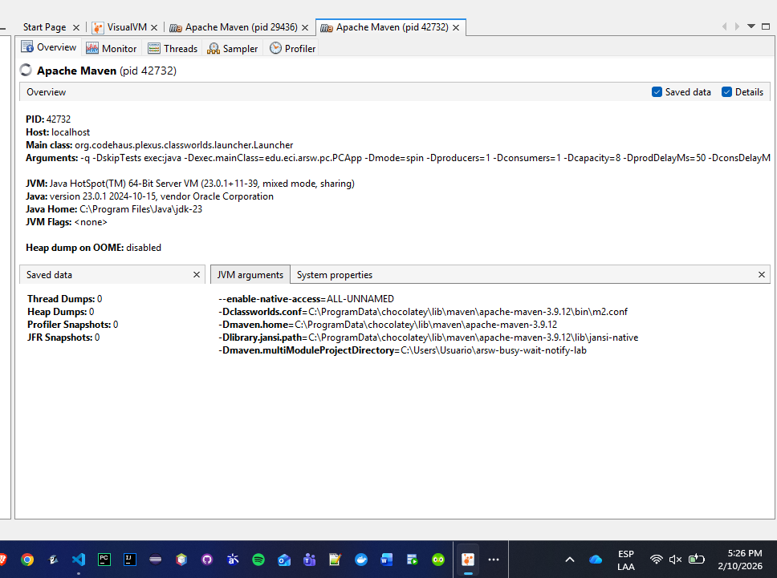
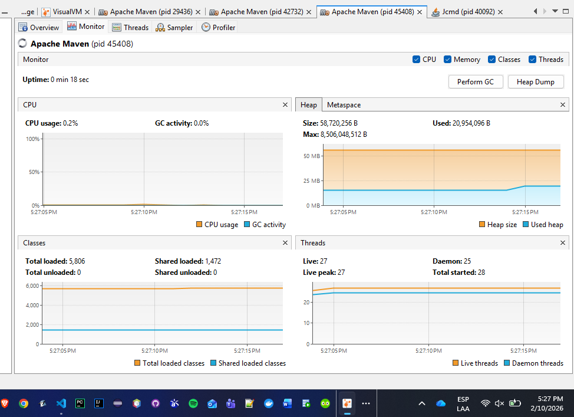
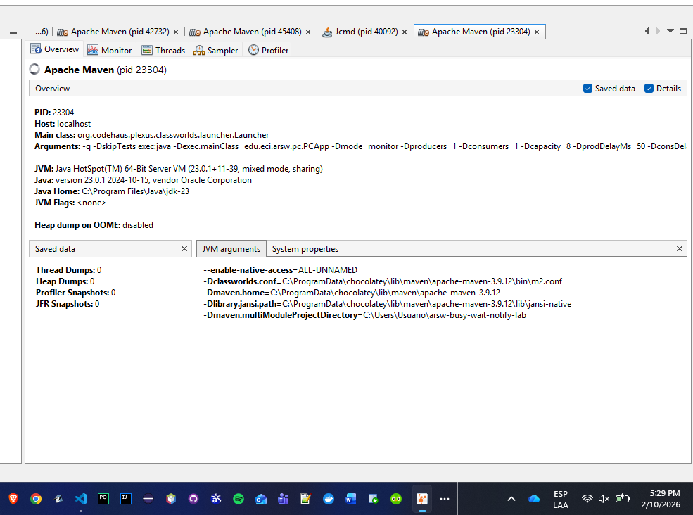
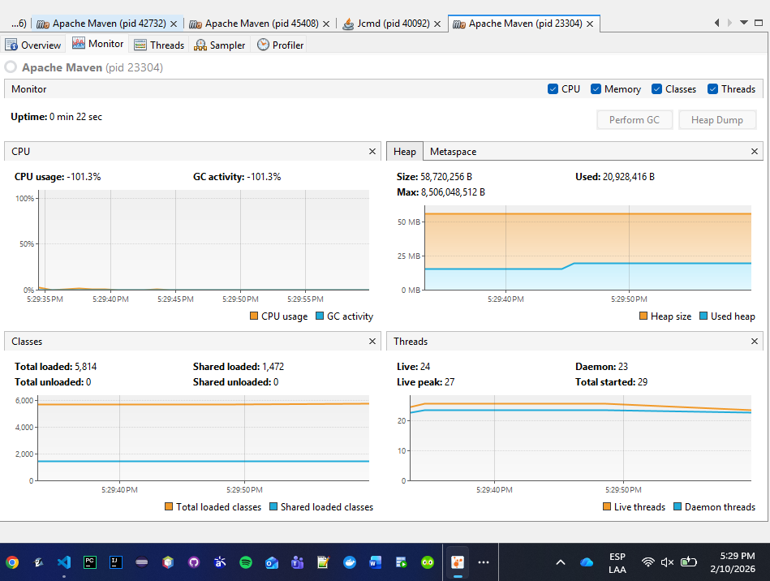

# Part I — Producer/Consumer with `wait/notify` (and contrast with busy-wait)

## Run with **busy-wait** (high CPU)
```bash
mvn -q -DskipTests exec:java "-Dexec.mainClass=edu.eci.arsw.pc.PCApp \
  -Dmode=spin -Dproducers=1 -Dconsumers=1 -Dcapacity=8 -DprodDelayMs=50 -DconsDelayMs=1 -DdurationSec=30"
```

## Run with **monitors** (efficient CPU usage)
```bash
mvn -q -DskipTests exec:java "-Dexec.mainClass=edu.eci.arsw.pc.PCApp \
  -Dmode=monitor -Dproducers=1 -Dconsumers=1 -Dcapacity=8 -DprodDelayMs=50 -DconsDelayMs=1 -DdurationSec=30"
```

## Scenarios to validate
1) **Slow producer / Fast consumer** → consumer must **wait without CPU** when there are no elements.
2) **Fast producer / Slow consumer** with **stock limit** → producer must **wait without CPU** when the queue is full (small capacity, e.g. 4 or 8).
3) Visualize CPU with **jVisualVM** and compare `mode=spin` vs `mode=monitor`.

---

## Key Differences: `BusySpinQueue` vs `BoundedBuffer`

| Aspect | `BusySpinQueue` (spin) | `BoundedBuffer` (monitor) |
|--------|------------------------|---------------------------|
| CPU Usage | **High** (constant spinning) | **Low** (threads sleep when waiting) |
| Thread State | RUNNABLE (always) | WAITING/TIMED_WAITING (when idle) |
| Mechanism | `while(true)` + `Thread.onSpinWait()` | `synchronized` + `wait()` + `notifyAll()` |
| Efficiency | ❌ Wastes CPU cycles | ✅ Releases CPU when blocked |

## Evidence Folder

### Busy-wait mode (spin) — High CPU


*jVisualVM Monitor: High CPU usage with busy-wait*


*jVisualVM Threads: Threads in RUNNABLE state constantly*

### Monitor mode (wait/notify) — Efficient CPU


*jVisualVM Monitor: Low CPU usage with monitors*


*jVisualVM Threads: Threads in WAITING state when idle*
